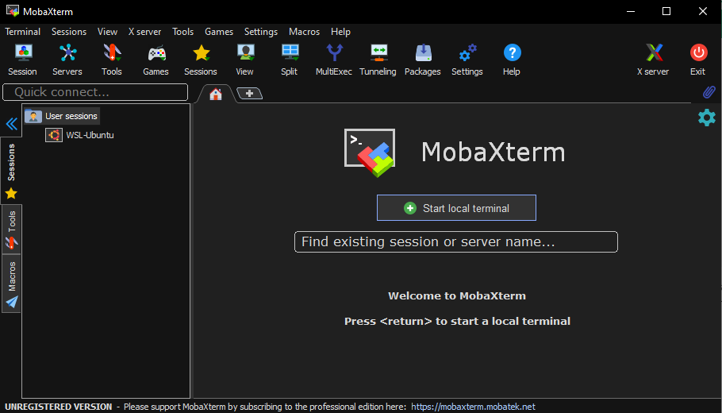
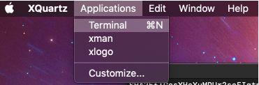
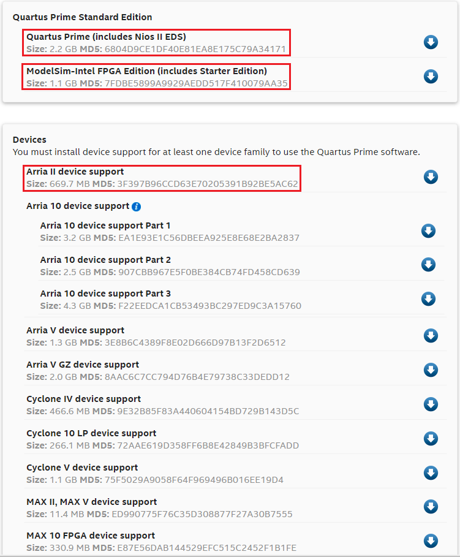
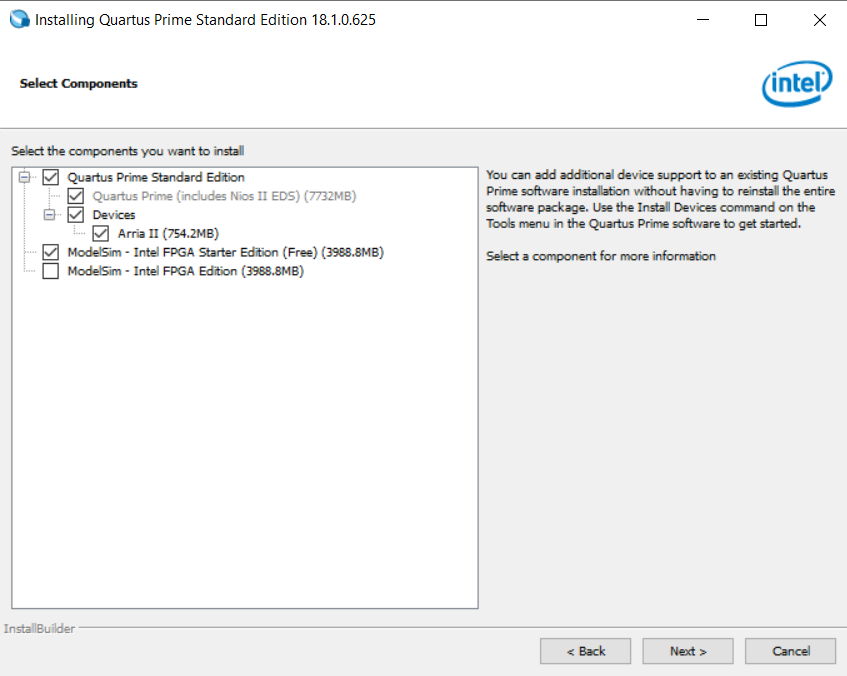
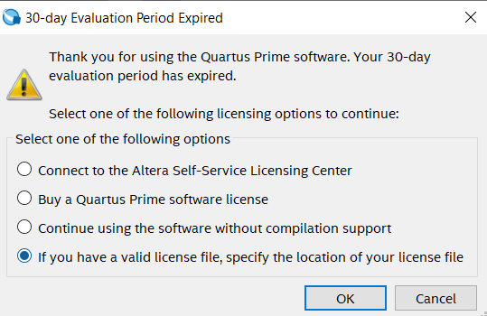
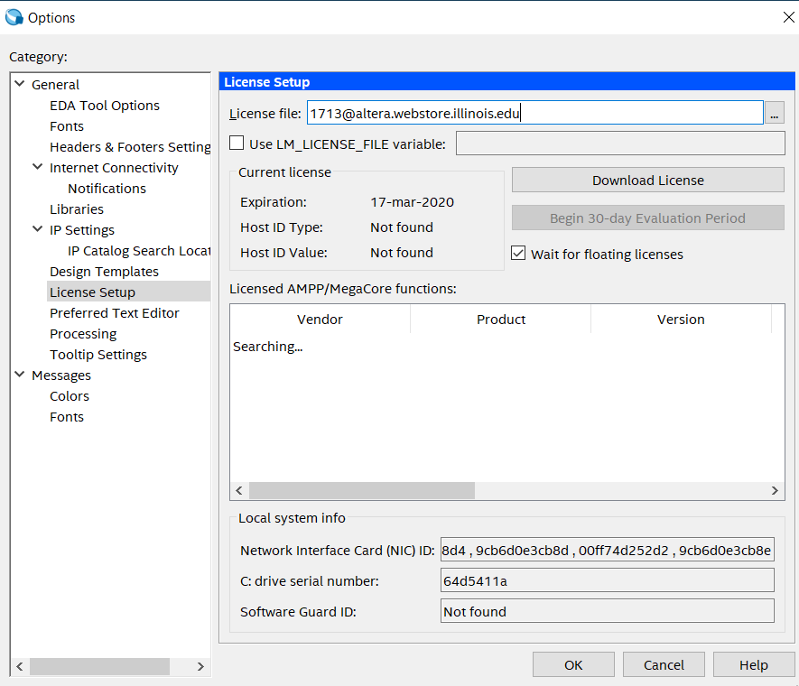
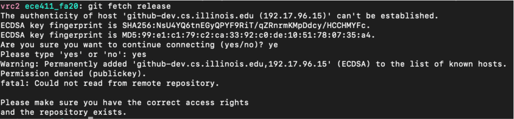
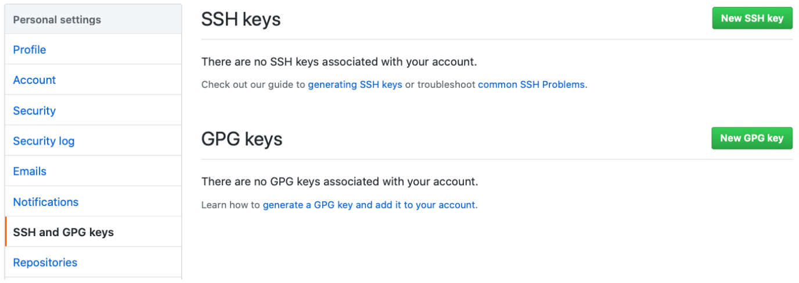
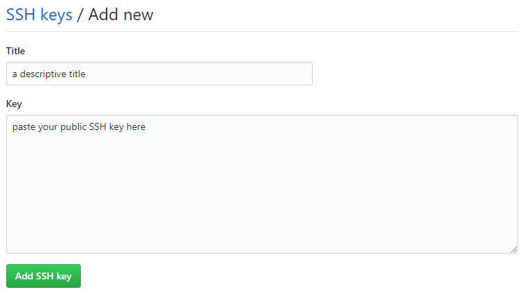

==========================
ECE 411: MP1 Documentation
==========================

-----------------
Environment Setup
-----------------

    The software programs described in this document are confidential and proprietary products of
    Altera Corporation and Mentor Graphics Corporation or its licensors. The terms and conditions
    governing the sale and licensing of Altera and Mentor Graphics products are set forth in written
    agreements between Altera, Mentor Graphics and its customers. No representation or other
    affirmation of fact contained in this publication shall be deemed to be a warranty or give rise
    to any liability of Altera and Mentor Graphics whatsoever. Images of software programs in use
    are assumed to be copyright and may not be reproduced.

    This document is for informational and instructional purposes only. The ECE 411 teaching staff
    reserves the right to make changes in specifications and other information contained in this
    publication without prior notice, and the reader should, in all cases, consult the teaching
    staff to determine whether any changes have been made.

.. contents:: Table of Contents
.. section-numbering::

-----

Introduction
============

Welcome to ECE 411! In this MP, you will set up your environment for the coming MPs this semester.
Fortunately, most of the work is done for you on EWS. This document will go over how you can work on
this course's MPs remotely by connecting to EWS, or locally if you choose to do so.

Environment Setup
=================

You have three options for your environment setup: SSH (with X-Forwarding), FastX, and a local installation of the software.
Once you are able to connect remotely to an EWS machine or have Quartus and ModelSim installed on your machine, you can move
on to the next section.

SSH (with X-Forwarding) generally performs better than FastX, although ModelSim is sometimes prone to crashes with X-Forwarding.

FastX is easy to set up, although students in the past have had issues with speed and crashes over FastX.

A local installation of Quartus and ModelSim performs well once everything is working, but may be more difficult to set up.

SSH (with X-Forwarding)
-----------------------

EWS has set up a couple of servers that students can access over SSH. You can reach these using your favorite
SSH client by connecting to EWS SSH server **linux.ews.illinois.edu**. More information about SSH could be found
`here <https://en.wikipedia.org/wiki/Secure_Shell>`_.

Most students have found that having a graphical ModelSim waveform is useful. You may be the same,
in which case you can set up X-forwarding. Many SSH clients already include built-in local X server. Some SSH
clients, however, require installing and configuring local X server separately.

`Here <https://datacadamia.com/ssh/x11/cygwinx_remote_client>`_ is a good article on how to setup local X servers.
`Here <https://www.ssh.com/ssh/command/>`_ is the list of command line arguments for SSH.

If you are using X-forwarding, please turn on compression (option -C in command line) in SSH, as X-forwarding
requires huge amount of bandwidth for Quartus and ModelSim. In real practice, SSH compression can reduce a huge
fraction of bandwidth use (~300 Mbps to ~10 Mbps from our experiences).
Also, please note that ModelSim does not perform well using X-Forwarding: It often crashes for no reason, or is
too slow to be usable at all. One trick here is to set the display to lower resolutions (1080p or less) when using
X-Forwarding, as ModelSim tend to crash less often on these settings.

Here are some SSH clients and tools on Windows, for example:

- MobaXterm (SSH client with built-in X server)
- PuTTY (SSH client)
- SecureCRT (SSH client)
- Xming (X server)
- WinSCP (File management for FTP, SFTP, SSH)

Windows
~~~~~~~

On Windows, we recommend using MobaXterm, as installation is simple and it already includes a built-in X server. If you would
like to use MobaXterm as your SSH client, follow these instructions.

Navigate `here <https://mobaxterm.mobatek.net/download-home-edition.html>`_ and follow the instructions to download and
install MobaXterm.

After installation, open MobaXterm. You should see the following window:

.. _Figure 1:

   Figure 1: MobaXterm

You can start a local terminal by clicking **Start local terminal** or by clicking the **+** sign by the Home tab.
In this terminal you can connect to EWS with (replacing ``NETID`` with your netID)::

    $ ssh -X -C NETID@linux.ews.illinois.edu

``-X`` enables X-forwarding and ``-C`` turns on compression for X-forwarding. You will be prompted for your password.
After that, you should be connected to EWS with X-forwarding enabled.

Mac
~~~

On Mac, we recommend using XQuartz. You can download and install Xquartz `here <https://www.xquartz.org/>`_.

Once installed, start the application XQuartz and open an xterm by selecting **Applications → Terminal**.

.. _Figure 2:

   Figure 2: XQuartz

Now, you can SSH into EWS by running (replacing ``NETID`` with your netID)::

    $ ssh -Y NETID@linux.ews.illinois.edu

After this, you should be connected to EWS with X-forwarding enabled.

FastX
-----

EWS has a remote X desktop set up for students as well. There are two ways to access FastX: either through a web
browser at fastx.ews.illinois.edu or by downloading a client and connecting to FastX through there. If you are choosing to
use FastX for your work environment, we recommend downloading the client as opposed to using the web browser. The
instructions and download for the client can be found `here <https://answers.uillinois.edu/illinois.engineering/81727>`_.
Students in the past have had issues with speed and crashes over FastX. We have worked over the summer to minimize
those issues, and please let staff know if you run into issues with FastX.

Local Download
--------------

If you have a particular aversion to using EWS services, you may be able to download Quartus from Intel directly.
The version we use in the class is 18.1 Standard Edition. While Quartus does have a free version (lite), it will
be missing some of the options used in future MPs.

Quartus and ModelSim are only available for Windows and Linux, so if you are running MacOS, you have to use EWS via SSH or FastX.

Linux Prerequisites
~~~~~~~~~~~~~~~~~~~

**Note for Linux:** Installing Quartus and ModelSim locally on Linux is not recommended, as this is a very painstaking process which requires complex library installs and system configurations. To make matters worse, the documentations are incomplete or obsolete for installing Quartus on Linux, and you may run into problems like missing libraries or random crashes after installation. If you want to challenge yourself and install Quartus on Linux, we would suggest you to use Ubuntu 18.04 LTS as your Linux Distro, and follow the instructions in `this document <https://www.intel.com/content/dam/www/programmable/us/en/pdfs/literature/manual/quartus_install.pdf>`_ as a startpoint.

**WARNING for local Linux Use:** Even if you are able to install both Quartus and Modelsim, you may not be able to open Modelsim from Quartus, and will have to pull HDL and HVL files manually into Modelsim, or write your own TCL script to do so, which can be annoying. Just be aware of these possible issues before you start this process.

When making these instructions, I personally started from a fresh Ubuntu 18.04.5 - Desktop (x64) distribution of Linux, which
can be found `here <https://releases.ubuntu.com/18.04.5/>`_. I did this on a virtual machine using VirtualBox, though other VM
clients likely should work fine if you want to use a virtual machine. As far as other distributions of Linux, these instructions
may vary.

Once your distribution is set up, download the university's VPN client from `here <https://webstore.illinois.edu/Shop/product.aspx?zpid=2600>`_.
However, additional steps must be taken to properly install the VPN client, which can be found `here <https://answers.uillinois.edu/illinois/page.php?id=47640>`_,
but I will reiterate the important steps.

First, extract the contents of the download, and execute the script inside with::

  $ tar -zxvf <downloaded-file>
  $ cd <extracted directory>/vpn
  $ sudo ./vpn_install.sh

Accept the license agreement when propted. You must also install the Ubuntu Network Manager plugins, which can be done via::

  $ sudo apt-get install openconnect network-manager-openconnect-gnome

Finally, to configure the VPN using the Network Manager:

1. Click on the "Network Manager" icon in your System Tray on your desktop.
2. In the menu that appears, go to **VPN Connections -> Configure VPN**.
3. Click **Add**.
4. Choose **Cisco AnyConnect Compatible VPN (openconnect)** and click **Create**.
5. Enter the following information:
    * Connection name: **Tech Services**
    * Gateway: **vpn.illinois.edu**
    * User name: Leave blank at this point.
6. Click **Save**.

Once this is done, and everytime you log in, you must start the VPN client such:

1. Click on the "Network Manager" icon in your System Tray on your desktop.
2. In the menu that appears, go to *VPN Connections* and click *Tech Services VPN*.
3. Click on the connection icon.
4. Enter the following information:
    * Group menu: Select **1_SplitTunnel_Default**
    * Username: **Your NetID**
    * Password: **Your Active Directory password**
5. Click **Login**.

The last step you must do before installing Quartus is to download and install the version of the libpng library for Ubuntu 18.04.
The reason we must do that is that the library was no longer supported for Ubuntu 16.0+, but Quartus still requires it.  Go to this
`link <https://launchpad.net/~ubuntu-security/+archive/ubuntu/ppa/+build/15108504>`_ and download the file *libpng12-0_1.2.54-1ubuntu1.1_amd64.deb*.
You should then be able to just run the downloaded *.deb* file as an executable to install the library.

General Quartus Installation
~~~~~~~~~~~~~~~~~~~~~~~~~~~~

You can find the downloads for Quartus and ModelSim on the `Intel Website <https://fpgasoftware.intel.com/>`_. You may need to register
for an Intel account to download them. On Linux, you may also need to set the setup file as executable once downloaded, which you can do
with the following command::

  $ chmod +x <quartus-setup-file>

Select the **Standard** edition, version **18.1** and your operating system.
Under the **Individual Files** tab, you need to download
**Quartus Prime, ModelSim-Intel FPGA Edition,and Arria II device support**. (about 4GB in total)

.. _Figure 3:

   Figure 3: Local Install Files to Download

Double click the QuartusSetup to begin the installation process. You will be asked to choose which components to install.
If all downloaded files are placed in the same directory, the default selection should be correct.

.. _Figure 4:

   Figure 4: Components to Install

Note that to run the Standard Edition of Quartus Prime, you need access to the University's license, and you must
be connected to the University's VPN. If you do not have UIUC's VPN client, it can be downloaded
`here <https://webstore.illinois.edu/Shop/product.aspx?zpid=2600>`_.

Once the installation is completed, launch Quartus Prime. A dialog box will open asking you to choose
a licensing option. Select **If you have a valid license file, specify the location of your license file**.

.. _Figure 5:

   Figure 5: Specify the location of your license file.

You will be directed to the License Setup Page. In the **License file** box, enter ``1713@altera.webstore.illinois.edu`` and
click OK.

.. _Figure 6:

   Figure 6: Components to Install

Alternatively, after Quartus has been launched, the License Setup Page can be access from **Tools → License Setup**.

ModelSim Installation on Linux
~~~~~~~~~~~~~~~~~~~~~~~~~~~~~~

So even though Modelsim is technically installed, you will likely have issues trying to open the program both through Quartus and by itself. To try to fix most issues we have seen, follow these steps:

    1. You must update and install a bunch of 32-bit libraries to get Modelsim to work. To do this, use these commands:
    ::

        $ sudo apt update
        $ sudo sudo apt install make gcc-multilib g++-multilib lib32z1 lib32stdc++6 lib32gcc1 expat:i386 fontconfig:i386 libfreetype6:i386 libexpat1:i386 libc6:i386 libgtk-3-0:i386 libcanberra0:i386 libice6:i386 libsm6:i386 libncurses5:i386 zlib1g:i386 libx11-6:i386 libxau6:i386 libxdmcp6:i386 libxext6:i386 libxft2 libxft2:i386 libxrender1:i386 libxt6:i386 libxtst6:i386 lib32ncurses5 libxext6

    2. You must also download and install freetype 2.4.12, which can be done from `here <http://download.savannah.gnu.org/releases/freetype/freetype-2.4.12.tar.bz2>`_. Once downloaded, extract the file
    and build it using these commands
    ::

        $ cd freetype-2.4.12
        $ ./configure --build=i686-pc-linux-gnu "CFLAGS=-m32" "CXXFLAGS=-m32" "LDFLAGS=-m32"
        $ make

    3. Now, navigate to the folder in which you installed Quartus and Modelsim (for me, this was under my home directory). There should be a directory called *modelsim_ase*. Enter this directory and enter the
    commands to copy the built freetype binaries into a new folder within the Modelsim files:
    ::

        $ sudo mkdir lib32
        $ sudo cp <locaiton-of-extracted-freetype>/freetype-2.4.12/objs/.libs/libfreetype.so* ./lib32

    4. Finally, before exiting the *modelsim_ase* directory, navigate further down into *bin*. There, you must edit the *vsim* script slightly, as follows:
        * The first uncommented line should read: **mode=${MTI_VCO_MODE:-" "}**. Modify this to instead read: **mode=${MTI_VCO_MODE:-"32"}**
        * Look for this line: **dir=`dirname $arg0`**. Insert the following new line under it: **export LD_LIBRARY_PATH=${dir}/lib32**
        * Look for this line: **vco="linux_rh60"**. Modify this to instead be **vco="linux"**

    5. Modelsim should now run if you run the *vsim* script from within the *modelsim_ase/bin* folder. From there you will be able to import the necessary HDL and HVL files to simulate and test your design.
    As of right now, we do not currently have a solution for Modelsim crashing when trying to open it from the Quartus menu.

RISC-V GNU Toolchain
--------------------

For MPs 2-4, we will be using the RISC-V GNU Toolchain for Linux to compile code to RISC-V. If you are
working on EWS through SSH or FastX, these are already set up and you can skip this section.

If you are working locally, you may find it helpful to install this toolchain on your local machine now. If you are on
Windows, you can install `WSL <https://docs.microsoft.com/en-us/windows/wsl/install-win10>`_ and proceed from there. If you are on Linux, we recommend using Ubuntu 18.04 LTS as your Linux Distro.

The source code for the RISC-V GNU toolchain can be found `here <https://github.com/riscv/riscv-gnu-toolchain>`_, or
you can follow `this guide <https://mindchasers.com/dev/rv-getting-started>`_ to get started with installing it.
**Note:** The RISC-V GNU toolchain is large, and installation may take a while.

For MPs 2-4, you should have at least these three binaries installed: ``riscv32-unknown-elf-gcc``,
``riscv32-unknown-elf-objcopy``, and ``riscv32-unknown-elf-objdump``.

Creating a Github Repository
============================

To create your git repository, go to `<https://edu.cs.illinois.edu/create-ghe-repo/ece411-fa21/>`_.

Next, create a directory to contain your ECE 411 files (this will include subdirectories for each
MP, so chose a name such as ``ece411``) and execute the following commands (replacing ``NETID`` with
your netid)::

  $ git init
  $ git remote add origin git@github-dev.cs.illinois.edu:ece411-fa21/NETID.git
  $ git remote add release git@github-dev.cs.illinois.edu:ece411-fa21/_release.git
  $ git fetch release
  $ git merge --allow-unrelated-histories release/MP1 -m "Merging provided MP1 files"
  $ git push --set-upstream origin master

If you have not set up SSH access to your github account, you may encounter an error similar to the following figure.

.. _Figure 6:

   Figure 6: Github SSH Error

You can create a public key for your SSH client by running the following (where ``NETID`` is replaced by your netID)::

    $ ssh-keygen -t rsa -b 4096 -C "NETID@illinois.edu"
    > Enter a file in which to save the key (~/.ssh/id_rsa): [press enter]
    > Enter passphrase (empty for no passphrase): [type passphrase]
    > Enter same passphrase again: [type same passphrase again]
    $ eval "$(ssh-agent -s)"
    $ ssh-add ~/.ssh/id_rsa

Print your public key to the terminal so you can copy it and add it to your Github::

    $ cat ~/.ssh/id_rsa.pub

Navigate `here <https://github-dev.cs.illinois.edu/settings/keys>`_ and you should see the following web page:

.. _Figure 7:

   Figure 7: SSH and GPG keys

Select **New SSH Key** and type in a descriptive title. Paste your copied public key into the **key** field:

.. _Figure 8:

   Figure 8: Enter your new SSH key.

Click **Add SSH key** and type in your password if prompted. If you were successful, ``$ git fetch release`` should work.

Alternatively, you may download the ``_release/mp1/`` directory from Github and copy the files
manually to your repository.

Testing Your Software
=====================

Quartus
-------

To run Quartus and ModelSim from an EWS Linux machine, you will need to load the software module every time you log on.
You can load the software module by running::

    $ module load altera/18.1-std

Then run quartus with::

    $ quartus &

In Quartus, use the **New Project Wizard** to create your MP1 project. Use your git repository's MP1 directory as the
project working directory. Name the project mp1. Create an empty project, and add ``setup/hdl/mp1.sv`` to the project files. Under
**Family, Device and Board Settings**, select the **Arria II GX EP2AGX45DF25I3** as your target device. In the **Simulation**
row, ensure **ModelSim-Altera** and **SystemVerilog HDL** are selected.

Synthesize the given design with **Start Analysis & Synthesis**. Ensure synthesis is complete and no errors were returned.

Now that the design is complete and synthesized, we can move on to running a simulation with ModelSim.

Adding Testbench in Quartus
---------------------------

In order to test our design, we will need to first create a testbench within Quartus. Under
**Assignments → Settings... → EDA Tool Settings → Simulation**, add a new compile test bench with the following settings:

- Test bench name: **mp1_tb**
- Top level module in test bench: **mp1_tb**
- Simulation Period: **Run Simulation until all vector stimuli are used**

Under the **Test bench and simulation files** section, add ``setup/hvl/mp1_tb.sv`` to the testbench files.
Click **OK** several times to save the settings.

Running RTL Simulation
----------------------

Under **Tools → Options... → EDA Tool Options**, make sure the path for ModelSim-Altera matches
``/software/quartus-std-18.1/modelsim_ase/linuxaloem`` exactly for EWS. If you are on a local installation, you must set
this to your installation path for ModelSim. It may look something like ``INSTALLATION_PATH/modelsim_ase/win32aloem``
for Windows.

Select **Tools → Run Simulation Tool → RTL Simulation**. Modelsim should open up and simulate the
testbench for a short time. Now, upon initiating ModelSim simulation from within Quartus, Quartus will
generate a Tcl script in the ``simulation/modelsim/`` directory. Upon launching the ModelSim GUI,
this Tcl script is executed.

You can also execute this Tcl script from the ModelSim shell. You can do this by running (from the terminal)::

    $ vsim -c
    > do simulation/modelsim/mp1_run_msim_rtl_verilog.do

**We recommend that you focus your testbench efforts on creating useful text output from ModelSim,
and use the waveform viewer as just another tool for debugging, not as your main verification tool.**

Running the simulation should have generated some files, namely ``simulation/modelsim/msim_transcript``, which
stores a log of the output that ModelSim produces. Make a copy of this file in your mp1 directory by running::

    $ cp simulation/modelsim/msim_transcript ./

Finally, add the transcript file from ModelSim to your git repository by running::

    $ git add msim_transcript

Then push your changes to your remote repository. You are now done with the setup portion of this MP! If all goes well, the autograder
should create a ``_grades`` branch notifying you it recognizes your added files. If you do not see this after an
autograder run, please notify the course staff.

FAQ
=====

1. Where should my ``msim_transcript`` file go?
    * Your transcript should be stored in the mp1 directory. That means from your base repository directory, it should be located at ``mp1/msim_transcript``.
2. Running ``make`` to compile the RISCV toolchain locally is taking forever.
    * Expect it to take 1-2 hours. You can speed up the process by running ``make -j`` to run in parallel.
3. Modelsim isn't launching?
    * In Quartus, click **Tools -> Options -> EDA Tool Options -> ModelSim-Altera**. Make sure your ModelSim-Altera directory is: `{INTEL_FPGA_HOME}/intelFPGA/18.1/modelsim_ase/linuxaloem`.
