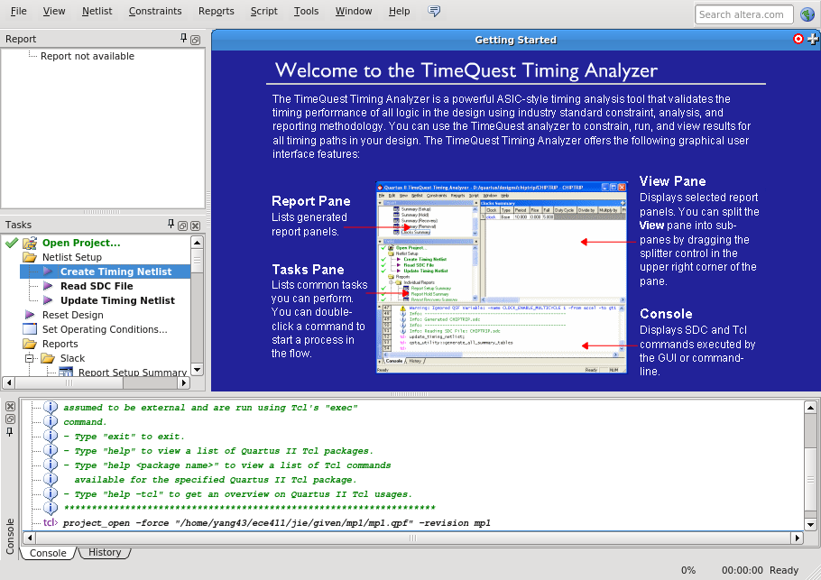
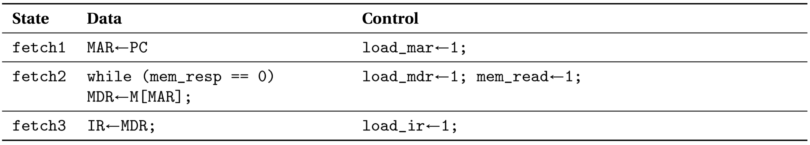

==========================
ECE 411: MP2 Documentation
==========================

---------------------------------------------
The RV32I Processor / Altera Quartus Tutorial
---------------------------------------------

    The software programs described in this document are confidential and proprietary products of
    Altera Corporation and Mentor Graphics Corporation or its licensors. The terms and conditions
    governing the sale and licensing of Altera and Mentor Graphics products are set forth in written
    agreements between Altera, Mentor Graphics and its customers. No representation or other
    affirmation of fact contained in this publication shall be deemed to be a warranty or give rise
    to any liability of Altera and Mentor Graphics whatsoever. Images of software programs in use
    are assumed to be copyright and may not be reproduced.

    This document is for informational and instructional purposes only. The ECE 411 teaching staff
    reserves the right to make changes in specifications and other information contained in this
    publication without prior notice, and the reader should, in all cases, consult the teaching
    staff to determine whether any changes have been made.

.. contents:: Table of Contents
.. section-numbering::

-----

.. Aliases for appendix references
.. _Appendix A: `Appendix A: Loading programs into your design`_
.. _Appendix B: `Appendix B: RTL`_
.. _Appendix C: `Appendix C: CPU`_
.. _Appendix D: `Appendix D: Control`_
.. _Appendix E: `Appendix E: Datapath`_

Introduction
============

Congratulations, you made it through your first ECE 411 Machine Problem! Now that you are familiar
with SystemVerilog design and verification, we will be moving on to study the RISC-V architecture.
In this MP we will step through the design entry and simulation of a simple, non-pipelined processor
that implements a subset of the RV32I instruction set architecture (ISA). This assignment (along
with material on the course web page) contains the specifications for the design. You will follow
the step-by-step directions to create the design and verify it using dynamic simulation.

The primary objective of this exercise is to give you a better understanding of multicycle micro-
architectures, and of the RV32I ISA. Additionally, you will learn how to use Intel Quartus software
to synthesize your design for an FPGA, and continue using Modelsim to verify your design.
Since your next MPs will require original design effort, it is important for you to understand how
these tools work now so that you can avoid being bogged down with tool-related problems later.

The remainder of this section describes some notation that you will encounter throughout this
tutorial. Most of this notation should not be new to you; however, it will be worthwhile for you to
reacquaint yourself with it before proceeding to the tutorial itself. See `The RV32I Instruction Set
Architecture`_ for a brief description of the relevant instructions in the RV32I instruction set.
The `Design Specifications`_ and `Design Entry`_ section provide a high-level view of the design
as well as a step-by-step procedure for entering the design of the processor using Intel Quartus.
See `Analysis and Functional Verification`_ for instructions on how to simulate your design using
ModelSim. The `Hand-ins`_ section contains the items you will need to submit for a grade, as well
as a breakdown of what is due for Checkpoint 1, and what is due for the Final hand-in. Also included
are several appendices that contain additional useful information.

As a final note, **read each and every word of the tutorial** and follow it very carefully. There
may be some small errors and typos. However, most problems that past students have had with this MP
came from missing a paragraph and omitting some key steps. Take your time and be thorough, as you
will need a functional MP2 design before working on future MPs.

Notation
--------
.. Much of this is probably redundant after MP0, and the typesetting stuff is more relevant to LaTeX
   than rst/html.  This should be updated later with more helpful/relevant details.

The numbering and notation conventions used in this document are described below:

- Bit 0 refers to the *least* significant bit.

- Numbers beginning with ``0x`` are hexadecimal.

- ``[address]`` means the contents of memory at location ``address``. For example, if
  ``MAR = 0x12``, then ``[MAR]`` would mean the contents of memory location ``0x12``.

- For RTL descriptions, ``pattern[x:y]`` identifies a bit field consisting of bits ``x`` through
  ``y`` of a larger binary pattern.  For example, ``X[15:12]`` identifies a field consisting of bits
  15, 14, 13, and 12 from the value ``X``.

- A macro instruction (or simply instruction) means an assembly-level or ISA level instruction.

- Commands to be typed on the terminal are shown as follows::

    $ command

  Do not type the dollar sign; this represents the prompt displayed by the shell (e.g.,
  ``[netid@linux-a2 ~]$``).

The RV32I Instruction Set Architecture
======================================

Overview
--------

For this project, you will be entering the SystemVerilog design of a non-pipelined implementation of
the RV32I instruction set architecture. Because RV32I is a relatively simple load-store ISA with a
robust toolchain published under GPL, it is a natural choice for our ECE 411 projects. The RISC-V
specification was created to be a free and open alternative to other popular ISAs and includes a 64
bit variant (and plans for 128 bit) and many extensions for atomic operations, floating point
arithmetic, compressed instructions, etc. For this MP, you will implement all of the RV32I
instructions with the exception of the ``FENCE*``, ``ECALL``, ``EBREAK``, and
``CSRR*`` instructions.

Instructions are fixed width and 32 bits in length, having a format where bits ``[6:0]`` contain the
opcode. The RV32I ISA is a *Load-Store* ISA, meaning data values must be brought into the General-
Purpose Register File before they can be operated upon. Each general-purpose register (GPR) is 32
bits in length, and there are 31 GPRs total, as well as the register ``x0`` which is hardwired as
constant ``0``.

The memory space of the RV32I consists of :math:`2^{32}` locations (meaning the RV32I has a 32-bit
address space) and each location contains 8 bits (meaning that the RV32I has byte addressability).
Due to the limitations of Modelsim, we will only be able to utilize a fraction of this 4GB memory
space.

The RV32I program control is maintained by the Program Counter (PC). The PC is a 32-bit register
that contains the address of the current instruction being executed.

----

   Figure 1: RV32I instruction formats

Detailed descriptions of all RV32-I instructions may be found in the `RISC-V specification`_.
Detailed encodings for each instruction can be found in the `instruction set listings`_ of the
above document.

.. _RISC-V specification: https://content.riscv.org/wp-content/uploads/2017/05/riscv-spec-v2.2.pdf#page=21
.. _instruction set listings: https://content.riscv.org/wp-content/uploads/2017/05/riscv-spec-v2.2.pdf#page=116

Memory Instructions
-------------------

Data movement instructions are used to transfer values between the register file and the memory
system. The load instruction (``LW``) reads a 32-bit value from the memory system and places it into
a general-purpose register. The store instruction (``SW``) takes a value from a general-purpose
register and writes it into the memory system.

The format of the ``LW`` instruction is shown below. The opcode (bits ``[6:0]``) is ``0000011``. The
effective address (the address of the memory location that is to be read) is specified by the ``rs1``
and ``imm[11:0]`` fields. The effective address is calculated by adding the contents of the ``rs1``
to the sign-extended ``imm[11:0]`` field.

The format of the ``SW`` instruction is shown below. The opcode of this instruction is ``0100011``.
As with the load instruction, the effective address is the memory location specified by the ``rs1``
and ``imm[11:0]``. The effective address is formed in the same manner as that of the ``LW`` except
that offset bits ``imm[4:0]`` come from the ``rd`` part of the instruction instead of the ``rs2``
portion. This is to ensure that the signals for selecting which register index to read or write are
not dependent on the instruction opcode.

Memory Alignment
~~~~~~~~~~~~~~~~
The memory address ``mem_address`` sent out of mp2.sv **must** be 4-byte aligned in order to conform 
with the memory specification. This means the last two bits must be zeroed out.

Memory Instructions on Half Words and Bytes
~~~~~~~~~~~~~~~~~~~~~~~~~~~~~~~~~~~~~~~~~~~

The RV32I ISA defines several memory operations that operates on data that is smaller than a full word (4 bytes).
For half-words (2 bytes or 16 bits), the architecture will obtain only 16 bits from memory and load that into ``rd``.
For ``LH``, the architecture will load the 16 bits and sign extend the value before loading it into ``rd``. On the other hand,
for ``LHU``, the architecture will zero extend the 16 bit value. ``LB`` and ``LBU`` achieve the same purpose as ``LH`` and ``LHU``
but obtain only 8 bits from memory.

The question then becomes *which 8 or 16 bits from the 32 bit field of memory should the architecture obtain?*
You may notice that the main ``mp2`` module has a fixed width of 32 bits for both ``mem_rdata`` and ``mem_wdata``, which means
that the CPU and Memory can only communicate at a fixed length of 32 bits per memory operation. Then it should be up to the
CPU to handle the indexing of specific bytes (8 or 16 bits) based on the calculated memory address. Sending a byte or half-word
to memory should utilize the bit mask ``mem_byte_enable`` described on `Design Specifications`_. You are not required to support 
unaligned memory accesses (this means executing lh x1, 0x83 is undefined behavior). For more information, please
refer back to the `RISC-V Load-Store Specifications`_. You will  **not** have to complete these memory instructions on half words
and bytes for checkpoint 1, but you will need to implement these for the final checkpoint.

.. _RISC-V Load-Store Specifications: https://content.riscv.org/wp-content/uploads/2017/05/riscv-spec-v2.2.pdf#page=30

Arithmetic Instructions
-----------------------

RV32I has nine register-immediate integer instructions: ``ADDI``, ``SLTI``, ``SLTIU``, ``XORI``,
``ORI``, ``ANDI``, ``SLLI``, ``SRLI``, and ``SRAI``. These instructions represent addition, set less
than (signed) comparison, set less than unsigned comparison, bitwise exclusive disjunction, bitwise
disjunction, bitwise conjunction, logical left shift, logical right shift, and arithmetic right
shift, respectively. The encoding format for these instructions is shown below. Note that ``SRLI``
and ``SRAI`` share the same ``funct3`` code, so you must look at the ``funct7`` portion of the
instruction to determine which is which. ``SLTI`` and ``SLTIU`` will write a value of 1 or 0 to
``rd`` depending on if the comparison is ``true`` or ``false``, respectively. Each instruction
operates on ``rs1`` and the I-type immediate. For comparison and shift, ``rs1`` represents the left
side of the operator and the immediate represents the right side of the operator (the shift amount).

.. figure:: doc/figures/instr_imm.png
   :alt: encoding of the register-immediate instructions
   :align: center
   :width: 100%

Additionally, RV32I has several `register-register integer computational instructions`__.
Make sure to implement the SUB instruction, since many students in the past seem to have
forgotten to implement that instruction.

.. __: https://content.riscv.org/wp-content/uploads/2017/05/riscv-spec-v2.2.pdf#page=27

Control Instructions
--------------------

The RV32I branch instructions, ``BEQ``, ``BNE``, ``BLT``, ``BGE``, ``BLTU``, ``BGEU``, cause program
control to branch to a specified address if the relationship between the first and second operand is
equal, not equal, less (signed), greater-or-equal (signed), less (unsigned), or greater-or-equal
(unsigned), respectively. When the branch is taken, the address of the next instruction to be
executed is calculated by adding the current PC value to the B-type immediate.

Additionally, RV32I supports two unconditional branching instructions which are used to create call
and return type operations, as well as implement function pointers.  These are the ``JAL`` and
``JALR`` instructions.  You do not need to implement these for Checkpoint 1, but will need them for
the final hand-in.

.. figure:: doc/figures/instr_jal.png
   :alt: encoding of the unconditional jump-and-link instructions
   :align: center
   :width: 100%

U-type Instructions
-------------------

The load upper immediate instruction, ``LUI``, puts a 20 bit immediate into the most significant
bits of the destination register, leaving the rest as zeros. Combined with ``ADDI``, you can place
any arbitrary 32 bit value into a RISC-V register. The add upper immediate PC instruction,
``AUIPC``, adds a 20 bit immediate (also padded with 12 zeros in the least significant bits) to the
PC and saves that value in the destination register.

----

Note: the RISC-V specification defines several pseudo-instructions -- instructions which are
actually translated into one or more different instructions by the assembler.  These are important
to be aware of when writing test code, because some pseudo-instructions may be translated into
something you didn't excpect.  See `Table 20.2`__ in the RISC-V spec for details.

.. __: https://content.riscv.org/wp-content/uploads/2017/05/riscv-spec-v2.2.pdf#page=122

Design Specifications
=====================

Signals
-------

The microprocessor communicates with the outside world (e.g., the memory) through an address bus,
read and write data buses, four memory control signals, and a clock.

Top Level Signals
~~~~~~~~~~~~~~~~~

``clk``
  A clock signal -- all components of the design are active on the rising edge.

``rst``
  A synchronous reset signal -- sampled at the rising edge of clk. When asserted, the architectural
  state should go to initial state, including the controller state machine and all the registers.

``mem_address[31:0]``
  The memory system is accessed using this 32 bit signal. It specifies the address that is to be
  read or written.

``mem_rdata[31:0]``
  32-bit data bus for receiving data *from* the memory system.

``mem_wdata[31:0]``
  32-bit data bus for sending data *to* the memory system.

``mem_read``
  Active high signal that tells the memory system that the address is valid and the processor is
  trying to perform a memory read.

``mem_write``
  Active high signal that tells the memory system that the address is valid and the processor is
  trying to perform a memory write.

``mem_byte_enable[3:0]``
  A mask describing which byte(s) of memory should be written on a memory write. The behavior of
  this signal is summarized in the following table:

  =====================  ==========
   ``mem_byte_enable``    Behavior
  =====================  ==========
   ``4'b0000``            Don't write to memory even if ``mem_write`` becomes active
   ``4'b????``            Write only bytes specified in the mask (by a 1) when ``mem_write`` becomes
                          active
   ``4'b1111``            Write all bytes of a word to memory when ``mem_write`` becomes active
  =====================  ==========

``mem_resp``
  Active high signal generated by the memory system indicating that the memory has finished the
  requested operation.

Bus Control Logic
-----------------

The memory system is asynchronous, meaning that the processor waits for the memory to respond to a
request before completing the access cycle. In order to meet this constraint, inputs to the memory
subsystem must be held constant until the memory subsystem responds. In addition, outputs from the
memory subsystem should be latched if necessary.

The processor sets the ``mem_read`` control signal active (high) when it needs to read data from the
memory. The processor sets the ``mem_write`` signal active when it is writing to the memory (and sets
the ``mem_byte_enable`` mask appropriately). ``mem_read`` and ``mem_write`` must never be active at
the same time! The memory activates ``mem_resp`` when it has completed the read or write request.
We assume the memory response will always occur so the processor never has an infinite wait.

Controller
----------

There is a sequence of states that must be executed for every instruction. The controller contains
the logic that governs the movement between states and the actions in each state. In the RV32I, each
instruction will pass through the fetch and decode states, and once decoded, pass through any states
appropriate for the particular instruction. See `Appendix D`_ for a partial state diagram
of the controller.

Design Entry
============

The purpose of this MP, as stated before, is to become acquainted with the RV32I ISA and the related
software tools. You will be using Quartus Prime from Intel to lay out designs and ModelSim to
simulate them for the remainder of the semester, so it is important that you understand how to use
the tools.

Note: If you wish to learn more about the features in Quartus, you can go through the Quartus
tutorials, which is available through Quartus itself (click on **Help**). These tutorials may cover
additional topics not covered here.

To run Quartus from an EWS Linux machine, run::

  $ module load altera/18.1-std && quartus &

To work remotely, use the ``-X`` option over ssh to enable X-forwarding.

To get the provided base code for MP2, from your ece411 MP directory, run::

  $ git fetch release
  $ git merge --allow-unrelated-histories release/mp2 -m "Merging MP2"

We also provide you several tools to help you interact with and test your design.  The most common
ones have been placed in the ``mp2/bin/`` directory, and are detailed below. Additional programs may
be found in the ``/class/ece411/software/`` directory on the EWS filesystem, with a README detailing
the purpose of each executable. (Note: this directory will not be visible via the file explorer or
using ``ls`` until you have opened it directly. ``cd`` to the software directory to make it appear.)

- ``rv_load_memory.sh`` generates a ``memory.lst`` file from ``.asm`` test code for use in testbench
  memory.  Use this to load test programs into your design in ModelSim.

- ``compile.sh`` generates a RISC-V binary file suitable for simulating with ``spike``. This
  requires ``baremetal_link.ld`` to be present in the same directory. Use this to verify the correct
  results of test code on a verified solution.

To begin work on the MP, you must set up certain environment variables::

  $ ECE411_SOFTWARE=/class/ece411/software
  $ export PATH=$PATH:$ECE411_SOFTWARE/riscv-tools/bin:$ECE411_SOFTWARE/bin
  $ export LD_LIBRARY_PATH=$LD_LIBRARY_PATH:$ECE411_SOFTWARE/lib64:$ECE411_SOFTWARE/riscv-tools/lib
  $ export PYTHONPATH=$PYTHONPATH:$ECE411_SOFTWARE/python2.7/site-packages

It is recommended that you add these lines to your ``~/.bashrc`` file so you don't have to type them
each time you log in.  You will have to logout and login again, reopen the terminal or source your
bashrc for the changes to take effect.

In Quartus, use the "New Project Wizard" to create your MP2 project. Use your git repository's MP2
directory as the project working directory.  Name the project `mp2'.  Create an empty project, and
add all of the SystemVerilog files from the ``mp2/hdl/`` directory. Under *"Family, Device and Board
Settings"*, select the **Arria II GX EP2AGX45DF25I3** as your target device.

Beginning the Design
--------------------

Some components for the RV32I have been provided for you. You will create several missing
components, connect them together to form the datapath, and implement a controller to sequence the
machine. Take a look at the `Datapath Diagram`_ in `Appendix E`_ to get a feel for what components
are provided and what components need to be created.

Complete the Datapath
~~~~~~~~~~~~~~~~~~~~~

Open up the datapath by double-clicking ``datapath.sv`` in the **Files** tab. The given
``datapath.sv`` file contains a couple of already instantiated components and a partial port
declaration. You will need to create and instantiate additional components and declare additional
ports to complete the design.

Create the Controller
~~~~~~~~~~~~~~~~~~~~~

Next, we create the controller for the processor as a state machine in SystemVerilog. A skeleton
controller is given in ``control.sv`` which you can use to follow along in this section. The basic
structure for a state machine can be written in the following manner:

.. code:: verilog
   :number-lines:

   import rv32i_types::*; /* Import types defined in rv32i_types.sv */

   module control
   (
       /* Input and output port declarations */
   );

   enum int unsigned {
       /* List of states */
   } state, next_states;

   always_comb
   begin : state_actions
       /* Default output assignments */
       /* Actions for each state */
   end

   always_comb
   begin : next_state_logic
       /* Next state information and conditions (if any) for transitioning between states */
   end

   always_ff @(posedge clk)
   begin: next_state_assignment
       /* Assignment of next state on clock edge */
   end

   endmodule : control

Connect the Datapath and Controller
~~~~~~~~~~~~~~~~~~~~~~~~~~~~~~~~~~~

The ``mp2.sv`` file contains the top-level module. The hierarchy of the project can be viewed under
the **Hierarchy** tab. You need to connect the datapath and controller you just finished. To do
this, follow a similar method as you did to connect components within the datapath. Declare the
relevant internal signals and instantiate (and connect) the two modules. Finish the controller for
all instructions by following the design in `Appendix B`_, `Appendix C`_, and `Appendix D`_.  You
will have to figure out the design for several of the instructions, including the register-register
integer computational instructions. After adding an instruction, try compiling your design and
testing the newly added instruction.

Analysis and Functional Verification
====================================

After the design has been entered, you will perform RTL simulation to verify the correctness of the
design. We recommend that you test your design after adding each instruction.

The main hvl file to use in simulation is ``mp2/hvl/top.sv``. This file does several things:

- it instantiates your MP2 design as the DUT;
- it instantiates one of two testbenches which provide input stimulus to the DUT;
- it instantiates an interface between itself, the testbench, the DUT, and memory, and generates a
  clock;
- it provides several halting conditions for your simulation;
- it instantiates a ``riscv_formal_monitor_rv32i``, which monitors the output as well as some of the
  internal state of the DUT and reports an error when the DUT outputs an incorrect value or enters
  an incorrect state. See `RISC-V Formal Verification Framework`__ for more details.

.. __: https://github.com/SymbioticEDA/riscv-formal

Two different testbenches are provided. To choose which one to instantiate in ``mp2/hvl/top.sv``,
set the ``TESTBENCH`` macro to either ``SRC`` or ``RAND``.

The ``SRC`` testbench drives the DUT by loading a program binary into memory, and executing the
program. This testbench should largely remain unchanged, instead modify the tests by modifying the
compiled program. We suggest using this testbench to execute simulations which use large amounts of
branches and jumps.

The memory model is provided as a behavioral SystemVerilog file ``memory.sv``. The model reads
memory contents from the ``memory.lst`` file in the ``simulation/modelsim/`` directory of your
Quartus project. See `Appendix A`_ for instructions on compiling RISC-V programs and loading them
into memory.

The ``RAND`` testbench drives the DUT by executing a sequence of randomly generated instructions.
This testbench can and should be modified, as we have only provided the code to test register-immediate instructions.
We suggest extending this testbench to support simulation of randomly
generated load-store, register-register instructions.

Testbench Memory Initialization
-------------------------------

See `Appendix A`_ for how to load an assembly program into the design. Use the instructions to load
the given test code in ``mp2/testcode/riscv_mp2test.s``.

Adding Testbench in Quartus
---------------------------

Under **Assignments → Settings...** add a new testbench with the following settings:

- Test bench name: **mp2_tb**
- Top level module in test bench: **mp2_tb**
- Simulation Period: **Run Simulation until all vector stimuli are used**

Under the **Test bench and simulation files** section, add all of the files in the ``hvl/``
directory. Click **OK** several times to save the settings.

RTL Simulation
--------------

Verify EDA Tool Settings
~~~~~~~~~~~~~~~~~~~~~~~~

Under **Assignments → Settings...** select **EDA Tool Settings** on the left side pane. Make sure
that **ModelSim-Altera** is selected as the simulation tool with the format **SystemVerilog HDL**
then click OK. Also, under **Tools → Options...** select **EDA Tool Options** and make sure the path
to the ModelSim-Altera binary is ``/software/quartus-std-18.1/modelsim_ase/linuxaloem``. Now, upon
initiating ModelSim simulation from within Quartus, Quartus will generate a Tcl script in the
``simulation/modelsim/`` directory. Upon launching the ModelSim GUI, this Tcl script is executed.

   Figure 2: Simulation options

You can, of course, execute this Tcl script from the ModelSim shell as in MP1. **We recommend that
you focus your testbench efforts on creating useful text output from ModelSim, and use the waveform
viewer as just another tool for debugging, not as your main verification tool.** If you have problems
viewing your waveform from ModelSim through SSH X-forwarding, refer to `Appendix F: VCS`_ for better
waveform views on SSH.

Run RTL Simulation
~~~~~~~~~~~~~~~~~~

Select **Tools → Run Simulation Tool → RTL Simulation**. Modelsim should open up and simulate the
testbench for a short time. Status and error messages are displayed in the transcript pane at the
bottom of the window. A prompt in the same pane allows you to enter commands for Modelsim. Before
continuing with RTL simulation, we will first set some user interface options.

- **Set the default radix**
  When printing out waveforms and lists, you will need all your signals to be displayed in
  hexadecimal. To set ModelSim to always display your signals in hexadecimal, select **Simulate →
  Runtime Options...** under **Default Radix**, choose **Hexadecimal** and click **OK** to exit.

- **Change to a fixed width font**
  To change your default font, select **Tools → Edit Preferences...** Then, under the **Window
  List** section, select **Wave Windows**. Within the **Font** section, click **treeFont** in the
  left pane and then click **Choose...** Select your favorite fixed width font (e.g., fixed,
  Consolas, Courier New, etc), set a comfortable size and click **OK** until you return to the main
  Modelsim window.

- **Set timeline time unit to ns**
  Select the **Wave → Wave Preferences...** Then, open the **Grid & Timeline** tab and under the
  **Timeline Configuration** section, change the time units to ns. Click **OK** to save the changes.
  If you don't see the **Wave** menu, click in the wave window first. Instead of the **Wave** menu,
  you can also click the blue icon near the bottom left of the wave window.

   Figure 3: Grid and timeline options

There are multiple ways of viewing the functionality of your design, we introduce a few options here.

Wave Traces
^^^^^^^^^^^

If the wave pane is not open already, select **View → Wave** to open it. To add signals to the wave,
drag them from the structure and objects panes on the left side to the wave pane. For now, find the
register file in your design (e.g., **top → dut → datapath → regfile**) and drag the data object
(from the object pane) to the wave pane. You can also do it by right clicking on the signal and
select **Add Wave** or using the shortcut ``Ctrl+W``. Expand the newly created node by clicking the
**+** sign to reveal the individual registers.

   Figure 4: The wave trace window

At the prompt in the transcript window, type the following to restart the simulation and then run it
for a specified amount of time::

  > restart -f
  > run 20000ns

Note that you can combine commands on the same line by separating them with a semicolon, like this::

  > restart -f; run 20000ns

After running the commands, you should see the wave window being populated with signal values. If
you set the default radix correctly above, the values should be displayed in hexadecimal. You can
change the radix of individual signals by right clicking the name of the signal and choosing a radix
in the context menu.

To add additional signals to the wave, simply drag them from structure and objects panes on the
left. You can reorder signals by dragging their names in the wave pane. Signals can also be grouped
or colored for easy viewing via the right-click context menu (**Group...** or **Properties...**).

Once you are satisfied with the layout of the wave window, you can save the layout for future use by
selecting **File → Save Format...** and specifying a location and name (the default name is
wave.do). This will save the wave format as a Modelsim macro file. Next time you open Modelsim, type
the following to run the macro file::

  > do wave.do

Or, to load your signals and run the simulation, you can combine the commands::

  > restart -f; do wave.do; run 20000ns

Lists
^^^^^

Lists give a textual representation of signals over time and can be used to view signal values at
certain events. To open the list pane, select **View → List** or type view list at the prompt.
Signals can be added by dragging and dropping into the list pane. Drag the ``mem_address``,
``mem_wdata``, ``mem_write``, and ``mem_byte_enable`` signals to the list window. Change the signal
properties (select the signal name then select **View → Properties...**) so that all values are in
the appropriate radix if necessary.

By default, each time a signal in the list window changes, it generates a new entry in the list. For
some signals, you may not want a new line every time its value changes. In this case, we only want
our list to generate entries when we are actually writing to our memory (when ``mem_write`` becomes
active). Therefore, we only want to trigger entries to be added to our list when ``mem_write``
changes. To accomplish this, select the ``mem_address``, ``mem_wdata``, and ``mem_byte_enable``
signals, choose **View → Properties...**, and select **Does not trigger line**.

   Figure 5: The lists window

Memory Lists
^^^^^^^^^^^^

Memory lists allow us to view the contents of memory at the current point in the simulation. To see
the memory list, select **View → Memory List** or type ``view memory`` at the prompt. Double click
the memory that you want to view to show its contents. For now, choose the memory from the
testbench. A new pane will open with the memory contents. To make the memory contents easier to
read, right click in the memory pane and select properties, then change the address and data radix
to **hexadecimal** and under **Line Wrap** choose to display 2 (or your favorite number) words per
line.

   Figure 6: The memory lists window

Testing Your Design
~~~~~~~~~~~~~~~~~~~

With the above tools, you should be able to verify the functionality of your design. You can use the
RV32I simulator (``spike``) to run any test code to determine the correct behavior for the code and
see if the operation of your design matches the expected behavior 
(``spike`` guide:  https://github.com/riscv/riscv-isa-sim). You should write your own test
code in RISCV assembly to test corner cases that might occur in your design and load it into memory
as described in `Appendix A`_.

In Modelsim, you can restart the current simulation by typing ``restart -f`` and run the simulation
by typing ``run 2000ns`` (or a time interval of your choosing).

Timing Analysis
===============

Once the design is functionally correct, we need to make sure that timing requirements are met with
respect to a given clock frequency. For this MP, the target frequency is *100MHz* (10ns period) under
**Slow 900mV 100C Model**.

To begin the timing analysis, first compile your design by selecting **Processing → Start
Compilation** (or press Ctrl+L). If you take a look at the compilation report under **TimeQuest
Timing Analyzer**, you should see a lot of failures due to Quartus assuming your target frequency is
1GHz by default. Note: the failures will show up as list items with red names.

Open up the TimeQuest Timing Analyzer by selecting **Tools → TimeQuest Timing Analyzer**. Double
click **Create Timing Netlist** in the Tasks pane on the left to generate a timing netlist for
analysis.

   Figure 7: The TimeQuest Timing Analyzer

Set Constraints
---------------

Set Clock Constraint
~~~~~~~~~~~~~~~~~~~~

Select **Constraints → Create Clock...** from the menu bar and specify a clock with 10ns period. For
**Targets**, click the **ellipses** to the right, then click **List** to get a list of ports.

Select **clk** and add it to the list on the right side, then click **OK**. Note the SDC command
field at the bottom of the Create Clock window. This command shows what constraint is being
specified. Here you can type a command directly instead of navigating through the GUI. For now,
click **Run** to create the constraint.

   Figure 8: Selecting clock to constrain

   Figure 9: Specifying clock constraints

To verify that your clock was created correctly, scroll down in the Tasks pane and double click
**Report Clocks** under **Diagnostics** to generate a clock summary.

It should show that ``clk`` is constrained to operate at 100 MHz. In the process, you should get a
warning about clock uncertainty. To fix this, select **Constraints → Derive Clock Uncertainty...**
and click **Run**. The clock uncertainty is not calculated until you update the timing netlist.

   Figure 10: The clock report

Set Input/Output Constraints
~~~~~~~~~~~~~~~~~~~~~~~~~~~~

In addition to the clock constraint, input and output constraints to the top level ports must also
be set. For simplicity, we will set all the input and output delays to zero. Select **Constraints →
Set Input Delay...** and in the dialog set Clock name to **clk**, set Delay value to **0**, under
Targets type **[all_inputs]**, and click Run.

   Figure 11: Specifying input constraints

Select **Contraints → Set Output Delay...** to set the output delays, the settings are the same as
for input delays, except **[all_inputs]** is replaced with **[all_outputs]**.

.. .. figure:: doc/figures/timing6.png
..    :alt: Specifying output constraints
..    :align: center
..    :width: 80%
..
..    Figure 12: Specifying output constraints

Write SDC File
--------------

After setting all constraints, double click **Update Timing Netlist** in the Tasks pane. Now save
the SDC (Synopsys Design Constraints) file by double clicking **Write SDC File...** in the Tasks
pane (you need to scroll all the way down in the pane), specify the SDC file name and then click OK.
The SDC file contains the commands that we specified above. To edit the constraints (e.g., to change
the clock period or to constrain additional input/output ports), you can either use the GUI (like
above) or edit the SDC file directly.

   Figure 12: Writing the SDC file

After the SDC File is written, it needs to be added to the project. Exit TimeQuest and select
**Project → Add/Remove Files in Project...** in the main Quartus window. Name the file
``mp2.out.sdc`` and add it to the project (make sure to look for *All Files*
instead of only *Design Files* in the select file dialog).

Run Timing Analysis
-------------------

After adding the SDC file to the project, run timing analysis again by double clicking **TimeQuest
Timing Analysis** in the Tasks pane (alternatively you can run the full compilation via **Processing
→ Start Compilation**). If all goes well, the Compilation Report should indicate that no timing
constraints were violated.

   Figure 13: The timing analysis summary

Hand-ins
========

Checkpoint 1
------------

For CP1, you must submit a design with

- **register-immediate** instructions;
- load word and store word memory instructions;
- all conditional branch operations (not ``JAL``, ``JALR``);
- both U-type instructions (``LUI``, ``AUIPC``).

Checkpoint 2 / Final
--------------------

The final hand in requires you to complete the design by adding all missing instructions (with the
exception of those listed as not implemented in the `Overview`_).

Additionally, you must submit a short RISC-V assembly program, **mp2/testcode/factorial.s**. Your
program should take as an input (hardcoded) an integer ``a`` and store the result ``a!`` to any
register. The program should be flexible to calculate any other integer factorials, such as 4!, 6!,
7!, etc., by changing a single variable. It does not have to handle 0! or negative factorials. Your
code must end in an infinite loop, and you *must use an iterative algorithm*. You must use load
instructions to initialize registers. Reference the sample program located at
*testcode/riscv_mp2test.s* for assistance with the example instructions you can use.

Please see `Appendix A`_ for a description of how to load a program into your processor.

Grading
=======

Autograder
----------

The autograder will test your design in two ways. First it will run many small tests that each
target a very minimal amount of functionality but together they should cover nearly all
functionality. This is the best way for the autograder to give you as much partial credit as
possible for small bugs. The second method of testing will be a larger test code that will test that
your design can successfully run larger sequences of instructions. No partial credit will be given
for this larger test code but it will not test corner cases as thoroughly as the targeted tests.

Additionally, **certain tests may be withheld from you until the CP1 and Final due-dates**. This
means that you should not treat earlier autograding runs as your verification effort. **You must
verify your own design.**

Since generating a timing report requires significantly more compilation effort than compiling for
simulation, the autograder will only grade timing at the deadlines and 24 hours prior to the
deadlines. You should run your own timing analysis to verify your own timing and be sure to commit
your SDC file to git.  The SDC file is not dependent on the rest of your design, so do this early.

Do **not** modify the following given design files, since they will be replaced by the autograder:
``alu.sv``, ``ir.sv``, ``pc_reg.sv``, ``regfile.sv``, ``register.sv``, ``rv32i_mux_types.sv``,
``rv32i_types.sv``.

A note on naming: The regfile module **must** be named ``regfile`` to comply with the autograder 
(ie: ``module regfile regfile``).

Important Note
~~~~~~~~~~~~~~~~
We are adding a new feature to the autograder that can auto-grade your assembly code. You will need to implement the factorial code in a function (using RISC-V C calling convention).
For a complete description of RISC-V C calling convention, please refer to

https://riscv.org/wp-content/uploads/2015/01/riscv-calling.pdf

https://cs61c.org/su20/projects/proj2/Understanding_RISC_V_Calling_Convention1.pdf

You may use the following template as a starting point:

        
.. code::

   factorial.s:
    .align 4
    .section .text
    .globl factorial
    factorial:
	    # Register a0 holds the input value
	    # Register t0-t6 are caller-save, so you may use them without saving
	    # Return value need to be put in register a0
	    # Your code starts here
    ret:
	    jr ra # Register ra holds the return address
    .section .rodata
    # if you need any constants
    some_label:    .word 0x6

Please let us know if you run into autograder-related issues.

Grading Rubric
--------------

====================  =====
**Item**              **%**
====================  =====
CP Targeted Tests     17
CP Longer Test        5
CP Timing Report      3
**CP Total**          25
Final Targeted Tests  50
Final Longer Test     15
Final Factorial       5
Final Timing          5
**Total**             100
====================  =====

Appendix A: Loading programs into your design
=============================================

To load a program into your design, you need to generate a memory initialization file, *memory.lst*,
that is placed into the simulation directory *mp2/simulation/modelsim/* (this directory may need to
be created if modelsim hasn't been run yet). The *rv_load_memory.sh* script located in the *mp2/bin*
directory can be used to do this.

The *rv_load_memory.sh* script takes a RISC-V assembly file as input, assembles it into a RISC-V
object file, and converts the object file into a suitable format for initializing the testbench
memory. The script assumes that your project directory structure is set up according to the
instructions in this document. If not, you'll need to edit the paths for the memory initialization
file and assembler at the top of the script. The default settings are shown below.

.. code::

   # Settings
   ECE411DIR={path to your ECE411 git repo}
   DEFAULT_TARGET=$ECE411DIR/mp2/simulation/modelsim/memory.lst
   ASSEMBLER=/class/ece411/software/riscv-tools/bin/riscv32-unknown-elf-gcc
   OBJCOPY=/class/ece411/software/riscv-tools/bin/riscv32-unknown-elf-objcopy
   OBJDUMP=/class/ece411/software/riscv-tools/bin/riscv32-unknown-elf-objdump
   ADDRESSABILITY=1

To execute *rv_load_memory.sh*, you need to supply the name of a RISCV assembly file and,
optionally, the location to write *memory.lst*.

.. code::

  ./rv_load_memory.sh <asm-file> [memory-file]

If you do see a permission denied error you will have to change the permission settings by

.. code::

  chmod u+x rv_load_memory.sh

You will have to only do this once.

By default, the script places the output at *mp2/simulation/modelsim/memory.lst*. Note that you
should specify the path to *rv_load_memory.sh* if you're not already in the *bin/* directory.

For example, suppose we want to generate a memory initialization file from the program
*mp2/testcode/my-test.s* and place the result in the default target path:

.. code::

  cd ~/ece411/mp2/bin/
  ./rv_load_memory.sh ~/ece411/mp2/testcode/my-test.s

If successful, you should see a message similar to:

.. code::

  Assembled ./mp2/testcode/my-test.s and wrote memory contents to ./mp2/simulation/modelsim/memory.lst.

Appendix B: RTL
===============

The tables in this section cover the RTL for **most** of the controller states needed for the first
checkpoint (e.g., **not** including **register-register** instructions).  You will have to finish the
rest on your own.

.. These tables were originally generated in LaTeX.  ReStructuredText supports table markup which
   would be able to accommodate this information (namely, list-tables, which allow wrapped text),
   but these are unsupported by the GitHub parser.  For now, the original LaTeX source is preserved
   in the file ./doc/figures/rtl_tables.tex.  If modifications are necessary, use this document to
   regenerate the necessary images.

FETCH Process
-------------

DECODE Process
--------------

SLTI Instruction
----------------

.. image:: doc/figures/rtl_slti.png
   :width: 90%
   :align: center

SLTIU Instruction
-----------------

SRAI Instruction
----------------

Other Immediate Instructions
----------------------------

BR Instruction
--------------

.. image:: doc/figures/rtl_br.png
   :width: 90%
   :align: center

LW Instruction
--------------

.. image:: doc/figures/rtl_lw.png
   :width: 90%
   :align: center

SW Instruction
--------------

AUIPC Instruction
-----------------

.. image:: doc/figures/rtl_auipc.png
   :width: 90%
   :align: center

LUI Instruction
---------------

.. image:: doc/figures/rtl_lui.png
   :width: 90%
   :align: center

Appendix C: CPU
===============

Control to Datapath
-------------------

==================  ================================
**Name**            **Type**
==================  ================================
``load_pc``         ``logic``
``load_ir``         ``logic``
``load_regfile``    ``logic``
``load_mar``        ``logic``
``load_mdr``        ``logic``
``load_data_out``   ``logic``
``pcmux_sel``       ``pcmux::pcmux_sel_t``
``cmpop``           ``branch_funct3_t``
``alumux1_sel``     ``alumux::alumux1_sel_t``
``alumux2_sel``     ``alumux::alumux2_sel_t``
``regfilemux_sel``  ``regfilemux::regfilemux_sel_t``
``marmux_sel``      ``marmux::marmux_sel_t``
``cmpmux_sel``      ``cmpmux::cmpmux_sel_t``
``aluop``           ``alu_ops``
==================  ================================

Datapath to Control
-------------------

==========  ================
**Name**    **Type**
==========  ================
``opcode``  ``rv32i_opcode``
``funct3``  ``logic [2:0]``
``funct7``  ``logic [6:0]``
``br_en``   ``logic``
``rs1``     ``logic [4:0]``
``rs2``     ``logic [4:0]``
==========  ================

Control to Memory
-----------------

===================  ===============
**Name**             **Type**
===================  ===============
``mem_read``         ``logic``
``mem_write``        ``logic``
``mem_byte_enable``  ``logic [3:0]``
===================  ===============

Memory to Control
-----------------
============  =========
**Name**      **Type**
============  =========
``mem_resp``  ``logic``
============  =========

Datapath to Memory
------------------
===============  ==============
**Name**         **Type**
===============  ==============
``mem_address``  ``rv32i_word``
``mem_wdata``    ``rv32i_word``
===============  ==============

Memory to Datapath
------------------

===============  ==============
**Name**         **Type**
===============  ==============
``mem_rdata``    ``rv32i_word``
===============  ==============

Appendix D: Control
===================

Control Signals
---------------

===================  =======================
**Name**             **Default value**
===================  =======================
``load_pc``          ``1'b0``
``load_ir``          ``1'b0``
``load_regfile``     ``1'b0``
``load_mar``         ``1'b0``
``load_mdr``         ``1'b0``
``load_data_out``    ``1'b0``
``pcmux_sel``        ``pcmux::pc_plus4``
``cmpop``            ``funct3``
``alumux1_sel``      ``alumux::rs1_out``
``alumux2_sel``      ``alumux::i_imm``
``regfilemux_sel``   ``regfilemux::alu_out``
``marmux_sel``       ``marmux::pc_out``
``cmpmux_sel``       ``cmpmux::rs2_out``
``aluop``            ``funct3``
``mem_read``         ``1'b0``
``mem_write``        ``1'b0``
``mem_byte_enable``  ``4'b1111``
``rs1``              ``5'b0``
``rs2``              ``5'b0``
===================  =======================

Control Diagram
---------------

See `Appendix B`_ for control state actions.

.. figure:: doc/figures/control.png
   :align: center
   :width: 80%
   :alt: RV32I control state diagram

   Figure 14: The RV32I control state diagram -- sufficient for **most** of checkpoint 1

Appendix E: Datapath
====================

Datapath Signals
----------------

==================  ====================  ================  ===========================================
**Name**            **Type**              **Origin**        **Destination**
==================  ====================  ================  ===========================================
``clk``             ``logic``             ``input port``    ``PC, IR, regfile, MAR, MDR, mem_data_out``
``load_pc``         ``logic``             ``control``       ``PC``
``load_ir``         ``logic``             ``control``       ``IR``
``load_regfile``    ``logic``             ``control``       ``regfile``
``load_mar``        ``logic``             ``control``       ``MAR``
``load_mdr``        ``logic``             ``control``       ``MDR``
``load_data_out``   ``logic``             ``control``       ``mem_data_out``
``pcmux_sel``       ``pcmux_sel_t``       ``control``       ``pcmux``
``alumux1_sel``     ``alumux1_sel_t``     ``control``       ``alumux1``
``alumux2_sel``     ``alumux2_sel_t``     ``control``       ``alumux2``
``regfilemux_sel``  ``regfilemux_sel_t``  ``control``       ``regfilemux``
``marmux_sel``      ``marmux_sel_t``      ``control``       ``marmux``
``cmpmux_sel``      ``logic``             ``control``       ``cmpmux``
``aluop``           ``alu_ops``           ``control``       ``ALU``
``cmpop``           ``branch_funct3_t``   ``control``       ``CMP``
``rs1``             ``rv32i_reg``         ``IR``            ``regfile, control``
``rs2``             ``rv32i_reg``         ``IR``            ``regfile, control``
``rd``              ``rv32i_reg``         ``IR``            ``regfile``
``rs1_out``         ``rv32i_word``        ``regfile``       ``alumux1, CMP``
``rs2_out``         ``rv32i_word``        ``regfile``       ``cmpmux, mem_data_out``
``i_imm``           ``rv32i_word``        ``IR``            ``alumux2, cmpmux``
``u_imm``           ``rv32i_word``        ``IR``            ``alumux2, regfilemux``
``b_imm``           ``rv32i_word``        ``IR``            ``alumux2``
``s_imm``           ``rv32i_word``        ``IR``            ``alumux2``
``pcmux_out``       ``rv32i_word``        ``pcmux``         ``PC``
``alumux1_out``     ``rv32i_word``        ``alumux1``       ``ALU``
``alumux2_out``     ``rv32i_word``        ``alumux2``       ``ALU``
``regfilemux_out``  ``rv32i_word``        ``regfilemux``    ``regfile``
``marmux_out``      ``rv32i_word``        ``marmux``        ``MAR``
``cmp_mux_out``     ``rv32i_word``        ``cmpmux``        ``CMP``
``alu_out``         ``rv32i_word``        ``ALU``           ``regfilemux, marmux, pcmux``
``pc_out``          ``rv32i_word``        ``PC``            ``pc_plus4, alumux1, marmux``
``pc_plus4_out``    ``rv32i_word``        ``pc_plus4``      ``pcmux``
``mdrreg_out``      ``rv32i_word``        ``MDR``           ``regfilemux, IR``
``mem_address``     ``rv32i_word``        ``MAR``           ``output port``
``mem_wdata``       ``rv32i_word``        ``mem_data_out``  ``output port``
``mem_rdata``       ``rv32i_word``        ``input port``    ``MDR``
``opcode``          ``rv32i_opcode``      ``IR``            ``control``
``funct3``          ``logic [2:0]``       ``IR``            ``control``
``funct7``          ``logic [6:0]``       ``IR``            ``control``
``br_en``           ``logic``             ``cmp``           ``control, regfilemux``
==================  ====================  ================  ===========================================

Datapath Diagram
----------------

.. figure:: doc/figures/datapath.png
   :align: center
   :width: 80%
   :alt: RV32I datapath diagram

   Figure 15: The RV32I datapath diagram -- sufficient for **most** of checkpoint 1

Appendix F: VCS
====================
VCS is a SystemVerilog simulation tool which compiles a SystemVerilog
testbench into a binary which executes the desired simulation.  VCS is
available on EWS and works very nicely over SSH.  The Synopsys waveform viewer
also works very nicely over SSH with X-Forwardng (`ssh -XC`), and with
Fast-X.

Load Synopsys Module and Set Environment
----------------------------------------

    :code:`$ module load Synopsys_x86-64`

    :code:`$ export VCS_HOME="/software/Synopsys-2020_x86-64/vcs/Q-2020.03-1"`

Compiling a Testbench
---------------------
This is specific to the mp2 testbench. You will have to change some of these commands
for future MPs.

To create the simulation binary, go to your ``hvl/`` directory and run

    :code:`$ vcs -sverilog -top -full64 mp2_tb top.sv`

To execute the simulation, run

    :code:`$ ./simv`

To compile the code for use with waveform viewer, run

    :code:`$ vcs -sverilog -top -full64 mp2_tb -debug_access+r top.sv`

and run

    :code:`$ ./simv -gui`

Additionally, you can have VCS output linting information with

    :code:`$ vcs -sverilog +lint=all -top -full64 mp2_tb top.sv`

Creating a Value Change Dump (VCD) File
---------------------------------------

`VCD
<https://en.wikipedia.org/wiki/Value_change_dump>`_
is an open, ASCII-encoded
file format which contains information needed to generate waveforms of a
digital design simulation.

SystemVerilog supports generating VCD dumpfiles with several system tasks:

1. `$dumpfile(string filepath)` sets the filename of the VCD file.

  a. `$dumpfile("results.vcd");` sets the dumpfile to "results.vcd".

2. `$dumpvars();` enables recording of **all** simulation variables into the
   dumpfile.

3. `$dumpvars(int unsigned levels, ...)` gives more fine grained control over
   which variables to dump.  Following the first argument, provide a comma
   seperated list of module instantiations.  The first argument, `levels`,
   determines the depth of submodules whose variables are addded to the
   dumpfile.  If `levels` is `0`, then all submodules are added recursively.

  a. `dumpvars(0, dut);` will add **all** variables in the design-under-test to
     the dumpfile.

  b. `dumpvars(1, dut.datapath, dut.control)` will
     add all signals from your cpu datapath and control, but will not add
     signals internal to their submodules.

4. `$dumplimit(int filesize)` will limit the maximum dumpfile size to
   `filesize` bytes.  This is an approximate limit, and may be violated by
   some relatively small amount dependent on things such as harddrive block
   size.

5. `$dumpoff();` and `$dumpon();` toggle VCD dumping off and on, respectively.
   This may be useful once you have narrowed down the location of a bug to
   allow you to only record a small chunk of an execution simulation.

Viewing a VCD File In GTKWave
-----------------------------

`GTKWave
<gtkwave.sourceforge.net>`_
is a waveform viewer published under GPL 2.0 and is available for Windows,
Linux, and Mac.

In addition to building from source, GTKWave is available through package
managers for most common Linux systems.

With GTKWave installed on your local system, you can run simulations and
produce waveforms on EWS, and then exfil those waveforms to your local machine
via `sftp` or `scp`, and then view the waveforms locally with GTKWave.
